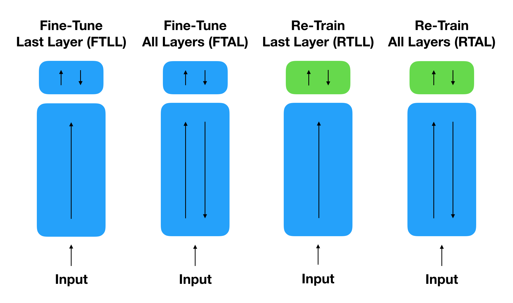

# WatermarkDNN

本实验复现论文[Turning Your Weakness Into a Strength: Watermarking Deep Neural Networks by Backdooring](https://www.usenix.org/system/files/conference/usenixsecurity18/sec18-adi.pdf). 这个存储库提供了通过后面和微调来为神经网络加水印、一些攻击实例脚本。

## Paper 

[Turning Your Weakness Into a Strength: Watermarking Deep Neural Networks by Backdooring](https://www.usenix.org/system/files/conference/usenixsecurity18/sec18-adi.pdf)
</br>
[Yossi Adi](https://adiyoss.github.io/)<sup>1</sup>, [Carsten Baum](http://www.carstenbaum.com/)<sup>1</sup>, [Moustapha Cisse](http://moustaphacisse.com/)<sup>2</sup>, [Benny Pinkas](http://www.pinkas.net/)<sup>1</sup>, [Joseph Keshet](http://u.cs.biu.ac.il/~jkeshet/)<sup>1</sup>
</br>
<sup>1 </sup>Bar-Ilan University, <sup>2 </sup>Google, Inc
</br>
第 27 届 USENIX 安全研讨会, [USENIX](https://www.usenix.org/conference/usenixsecurity18).</br>

## Content
此存储库包含用于嵌入水印的触发器集图像.

目前代码仅支持在 [CIFAR-10](https://www.cs.toronto.edu/~kriz/cifar.html) 数据集上进行训练和评估 

## Dependencies
[Python 3.6](https://www.anaconda.com/download)

[PyTorch 0.4.1](https://pytorch.org/)

torchvision 0.2.1

[cuda 9.2](https://developer.nvidia.cn/cuda-toolkit-archive)

[cudnn 7.6.2](https://developer.nvidia.cn/rdp/cudnn-archive)

## Usage

### 1. Training

`train.py` 脚本允许您使用或不使用触发器集来训练模型.

例: 
```
python train.py --batch_size 100 --max_epochs 60 --runname train --wm_batch_size 2 --wmtrain
```
对于没有设置触发器的训练，省略 `--wmtrain` 标志.
</br>
如果您想恢复训练，可以使用`--resume` 标志.


#### New Trigger Set
要使用您自己的触发器集和标签进行训练，请提供使用标志的数据路径 `--wm_path` 和使用标志的触发器集的路径 `--wm_lbl` .

### 2. Testing

`predict.py` 脚本允许您在 CIFAR10 测试集或提供的触发器集上测试您的模型. </br>
要在 CIFAR10 数据集（没有触发器集）上测试经过训练的模型，请运行以下命令: 
```
python predict.py --model_path checkpoint/model.t7
```
要在指定的触发器集上测试经过训练的模型，请运行以下命令: 
```
python predict.py --model_path checkpoint/model.t7 --wm_path ./data/trigger_set --wm_lbl labels-cifar.txt --testwm
```

### 3. Fine-Tuning

我们定义了四种微调方法：微调最后一层 (FTLL)、微调所有层 (FTAL)、重新训练最后一层 (RTLL) 和重新训练所有层 (RTAL)。上述方法的图解说明如下: 
</br>

下面我们提供了所有四种微调技术的示例脚本.

#### Fine-Tune Last Layer (FTLL)
```
python fine-tune.py --lr 0.01 --load_path checkpoint/model.t7 --save_dir checkpoint/ --save_model ftll.t7 --runname fine.tune.last.layer
```

#### Fine-Tune All Layers (FTAL)
```
python fine-tune.py --lr 0.01 --load_path checkpoint/model.t7 --save_dir checkpoint/ --save_model ftal.t7 --runname fine.tune.all.layers --tunealllayers
```

#### Retrain Last Layer (RTLL)
```
python fine-tune.py --lr 0.01 --load_path checkpoint/model.t7 --save_dir checkpoint/ --save_model rtll.t7 --runname reinit.last.layer --reinitll
```

#### Retrain All Layers (RTAL)
```
python fine-tune.py --lr 0.01 --load_path checkpoint/model.t7 --save_dir checkpoint/ --save_model rtal.t7 --runname reinit_all.layers --reinitll --tunealllayers
```

### 4. Backdoor attack
后门攻击命令
```
python Backdoor_attack.py --save_model attack_model.t7 --runname AttackTrain --wmtrain --attack_train
```

### 4. FGSM
对抗样本攻击命令：
```
python FGSM.py
```

### 4. data poison
数据投毒命令:
```
python Data_poison.py --load_path ./checkpoint/DataPoison_model.t7
```

